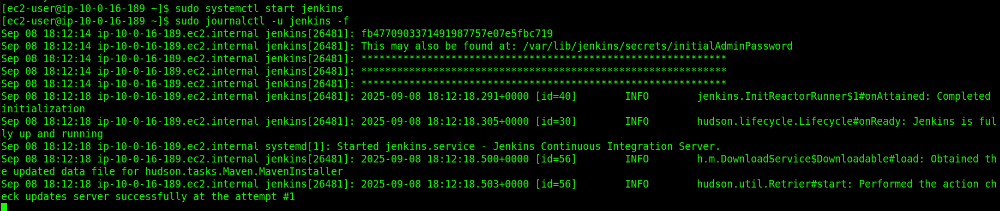

**What is CI/CD**  
A CI/CD pipeline is an automated process that helps developers build, test, and deploy applications faster and more reliably.

* **CI (Continuous Integration):**
    * Developers frequently integrate (merge) their code changes into a shared repository.
    * Every code change triggers an automated build and test process.
    * This ensures new code works well with the existing codebase and bugs are caught early.
* **CD (Continuous Delivery/Deployment):**
    * **Continuous Delivery:** Code that has passed testing is automatically prepared for release. Deployments still require a manual approval step.
    * **Continuous Deployment:** Code is automatically deployed to production after passing all tests, with no manual intervention.


* **Install Jenkins On AWS Linux**
    * Install Java verison 21 
        ``` 
         sudo yum install java-21-amazon-corretto
        ```
    * Now Install Jenkins.
        * use this links to install Jenkins.
        * [JenkinsDocsOffical](https://www.jenkins.io/doc/book/installing/linux/).
        * [InstallJava21](https://docs.aws.amazon.com/corretto/latest/corretto-21-ug/amazon-linux-install.html) 
    * Check Password with Journalctl command

        ```
            sudo systemctl start jenkins
            sudo journalctl -u jenkins -f
        ```
        
* **Key parts inside System Configuration:**
    * **System (Configure System)**
        * General settings like:
        * Jenkins URL (the root URL of your server).
        * Global environment variables.
        * Locations for tools (JDK, Git, Maven, Gradle, Docker, etc.).
        * Email notification settings (SMTP).
        * Security (like access to GitHub, GitLab, AWS, etc.).
    * **Global Tool Configuration**
        * Configure build tools that Jenkins jobs can use, for example:
            * JDK installations.
            * Git installations.
            * Maven/Gradle.
            * NodeJS, Python, etc.
    * **Nodes and Clouds**
        * Manage where Jenkins runs jobs:
        * Master node executors.
        * Agent nodes (slaves).
        * Cloud integrations (like Kubernetes, AWS, Azure agents).
    * **Credentials**
        * Store secrets (SSH keys, tokens, passwords) securely for use in pipelines.
        * Plugins (via System Configuration → Manage Plugins)
        * Extend Jenkins functionality (GitHub, Slack, Docker, Kubernetes, etc.).

* **What are Freestyle Jobs in Jenkins?**
    * A Freestyle Job in Jenkins is the most basic and flexible project type.It allows you to configure and run simple automation tasks like:
        * Building source code.
        * Running shell/batch scripts.
        * Deploying applications.
        * Running tests.
        * Freestyle jobs are GUI-driven (configured via forms in the Jenkins dashboard), unlike Pipeline jobs, which are defined in code (Jenkinsfile).
    * **Steps to Create a Freestyle Job:**
        * **Configure the job:**  
            * **General:** Add description, parameters.
            * **Source Code Management (SCM):** Connect to Git, SVN, etc.
            * **Build Triggers:** Decide when to run (manual, SCM changes, cron, webhook). [MoreInfoAboutBuildTriggers]([text](https://codefresh.io/learn/jenkins/9-jenkins-build-triggers-and-how-to-use-them-effectively/#:~:text=Build%20triggers%20in%20Jenkins%20cover,reliability%20of%20software%20delivery%20pipelines.))
            * **Build Environment:** Configure environment variables, credentials.
            * **Build Steps:** Add shell commands, Maven/Gradle build, Windows batch, etc.
            * **Post-Build Actions:** Notifications, archive artifacts, deploy, etc.


* **Setting Up a Build Agent**
* **Distributing a Build**
* **Monitoring Build Agent**