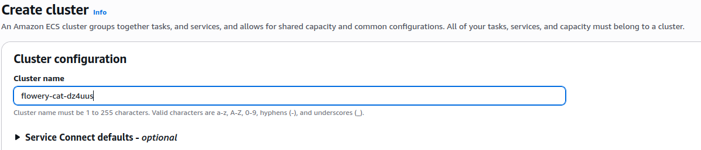
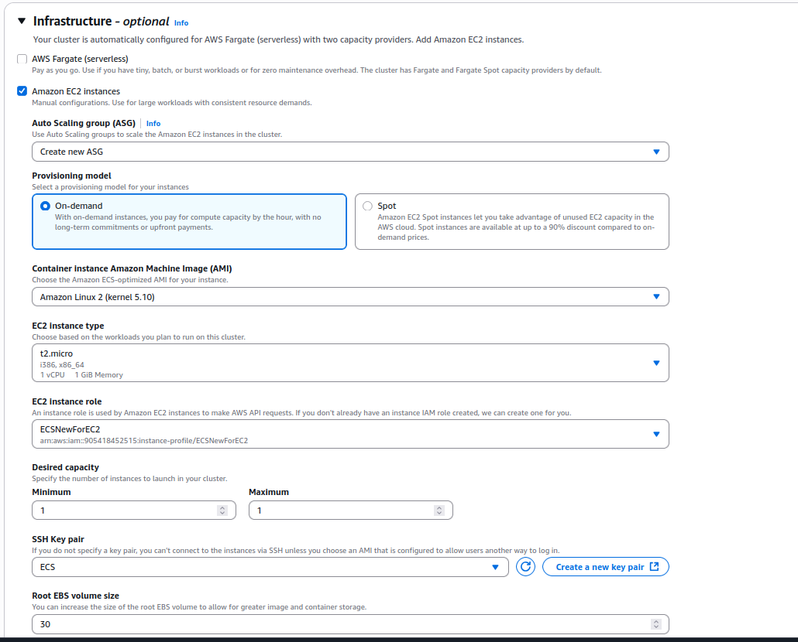
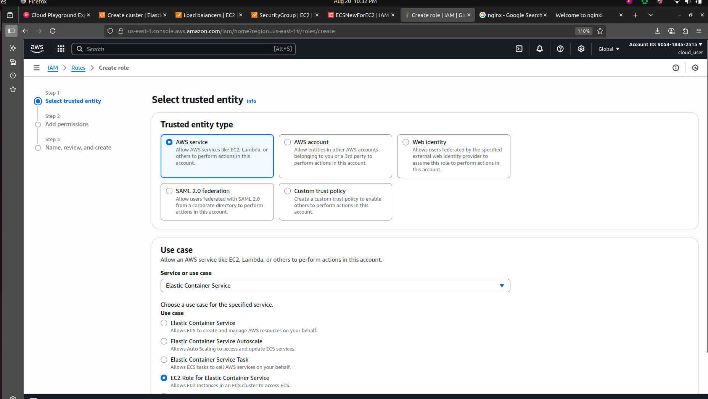
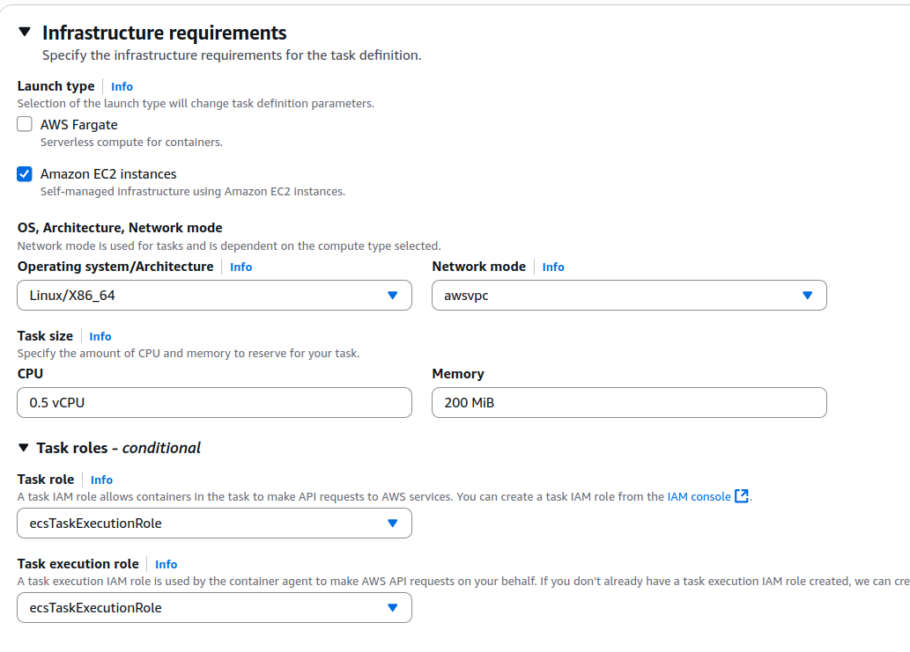

# Create ECS Deployment On EC2 

> It is a fully managed container orchestration service by AWS that lets you run and manage Docker containers at scale, without having to install and operate your own Kubernetes or Docker Swarm.


## Cluster Name Define 




## Infrastructure 




## EC2 instance type

> I faced issue about mermory related. when i create a container i used extra memory that because i face this issue. 
> t2.mirco 1vCPU or 1 GB Memory.
> always remember when you create container use low memory.


## EC2 instance role

> i face this issue also. so create a role first when you create ECS on EC2. 
> Amazon ECS container instance IAM role [iam role for ECS](https://docs.aws.amazon.com/AmazonECS/latest/developerguide/instance_IAM_role.html) .



## Network settings for Amazon EC2 instances  Info
> I took default setting.

## Task definitions
> create new task definition 
> image : nginx, Port : 80



>```  
>"cpu": "512",
>"memory": "200",
>"runtimePlatform": {
>    "cpuArchitecture": "X86_64",
>    "operatingSystemFamily": "LINUX"
>}
>
>```

## Create Service
> select lounch type EC2, add networking setting default, add loadbalancer for access container


# Face issue

>```
> 1. ECS role related issue.
> 2. give extra memory to container.
> 3. security inbound permission.
>
>```


