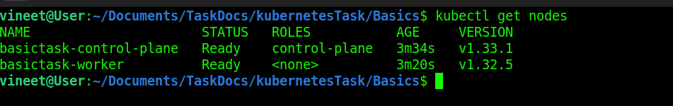
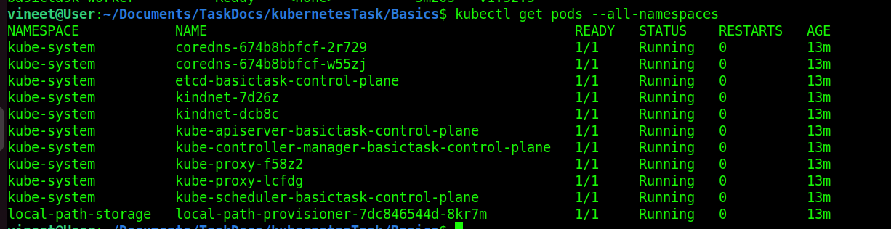
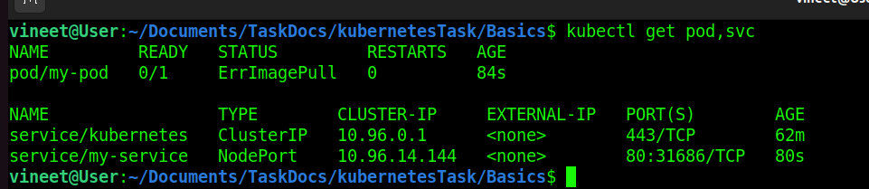
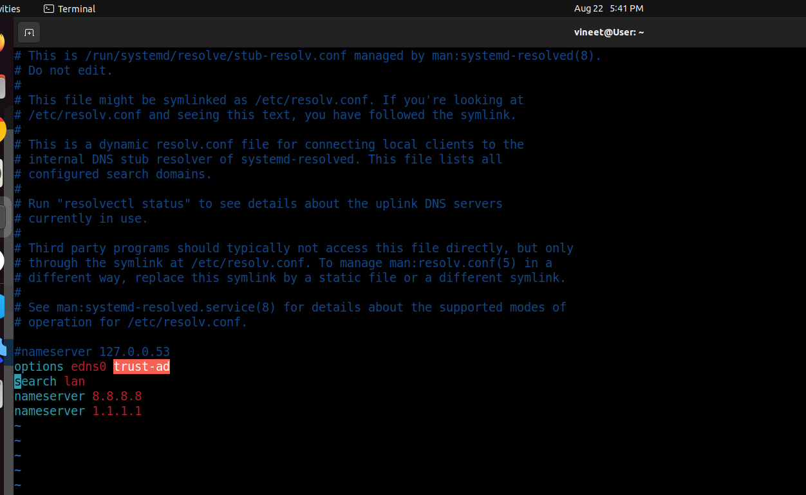
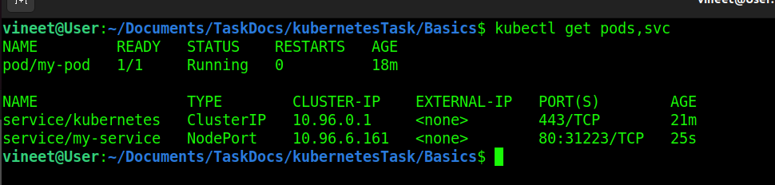
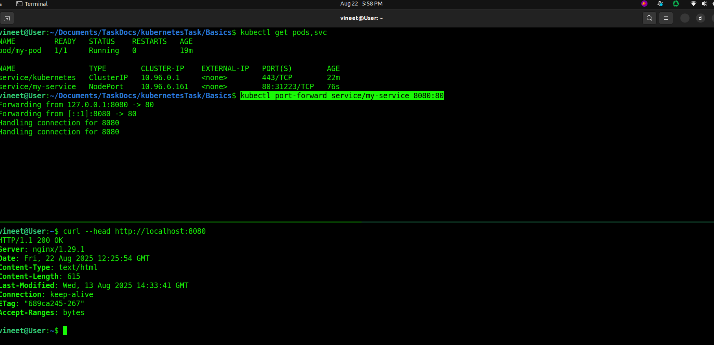

# Basic Kubernetes 

### What is Kubernetes ?
> Kubernetes, also known as K8s is an open-source container orchestration system for automating software deployment, scaling, and management. Originally designed by Google, the project is now maintained by a worldwide community of contributors, and the trademark is held by the Cloud Native Computing Foundation.

### What is Pod ?
> In Kubernetes, a Pod is the smallest deployable unit.
> A Pod runs one or more containers (like Docker containers).
> Containers inside the same Pod:
> > Share the same network (they can talk to each other over localhost).
> > Share storage volumes if defined.
> Pods are ephemeral:
> > If a Pod dies, Kubernetes replaces it with a new one (but with a different IP).
> > That’s why we use ReplicaSets / Deployments to keep them running.

### What is Node ? 
> In Kubernetes, a Node is basically a worker machine (VM or physical server) where your Pods actually run.
> Each Node runs some important Kubernetes components:
> > kubelet → talks to the control plane and makes sure containers in Pods are running.
> > kube-proxy → handles networking and service discovery.
> > Container runtime (Docker, containerd, CRI-O, etc.) → runs the actual containers.
> Nodes can host multiple Pods depending on their resources (CPU, RAM).


### What is Control Plane ?
> The Control Plane is the “brain” of Kubernetes.
> It manages the cluster state — deciding what should run, where, and how.
> # Key Components of the Control Plane:
>
> #### kube-apiserver
> > The "front door" of Kubernetes.
> > All requests (from kubectl, dashboard, or other components) go through it.
> 
> #### etcd
> > A distributed key-value store that keeps the cluster’s state (e.g., what Pods exist, their configs, secrets, etc.).
> 
> #### kube-scheduler
> > Decides which Node a new Pod should run on (based on CPU, memory, affinity, taints/tolerations, etc.).
> 
> #### kube-controller-manager
> > Runs background controllers that make sure the cluster matches the desired state.
> > Example: If a Pod dies and replicas < desired, it creates a new Pod.
> 
> #### cloud-controller-manager (optional, for cloud environments)
> alks to the underlying cloud provider (AWS, GCP, Azure) for things like load balancers, storage, nodes.


## Install minikube or use kind on your laptop.

> ```Install Minikube On Laptop [Minikube Link](https://minikube.sigs.k8s.io/docs/start/?arch=%2Flinux%2Fx86-64%2Fstable%2Fbinary+download).
>
> Install Kind On Laptop [Kind Link](https://kind.sigs.k8s.io/docs/user/quick-start/)
>
> All Kubernetes tools Link [Link](https://kubernetes.io/docs/tasks/tools/)


## After That Create Kubernetes Cluster 

> ```
> I Used Kind To Create Cluster.  
> I Create Cluster.yaml file to create cluster with two node. [Cluster.yaml](Cluster.yaml)
> In Node i used To diffrent Type Of Version Image 
> In control-plane : image v1.33.1 
> In worker : image v1.32.5 
> that because Control-plane image verison always > to worker node image verison. 
> 
> ```

### To Create Cluster With Kind Used Commnad .

>>  ``` kind create cluster --name basictask --config Cluster.yaml  ```

> To Delete Cluster 
>> ``` kind delete cluster --name basictask ```


### Perform Commands 

>> ``` kubectl get nodes ```




>> ``` kubectl get pods --all-namespaces ``` 



> This Command Show all pods from all namespaces.

### This shows you all the system Pods running inside your Kubernetes cluster. Let’s break down what you see:

> #### Control Plane Components (in kube-system namespace):
>
> > etcd-basictask-control-plane → Stores cluster state (key-value DB).
>
> > kube-apiserver-basictask-control-plane → API server, entry point to the cluster.
> 
> >kube-controller-manager-basictask-control-plane → Runs controllers (replica, node, job controllers, etc.).
>
> > kube-scheduler-basictask-control-plane → Decides which Node runs a Pod.

<hr>

> ### Networking Components:
>
> > kube-proxy-f58z2 and kube-proxy-lcfdg → Network routing for Services inside cluster.
>
> > kindnet-7d26z / kindnet-dcb8c → CNI plugin (Kindnet) providing Pod networking.

<hr>

> ### Core DNS (for Service discovery):
>
> > coredns-674b8bbfcf-2r729 / coredns-674b8bbfcf-w55zj → Resolves DNS names inside cluster (e.g., ```myservice.default.svc.cluster.local)```.

<hr>

> ### Storage:
>
> > local-path-provisioner-7dc846544d-8kr7m → Dynamic storage provisioner (for creating PersistentVolumes on local storage).

<hr>


## Deploy a simple nginx pod.

This is Simple nginx Pod Code [Pod.yaml](../Basics/pod.yaml)  
This is Service file [service.yaml](../Basics/service.yaml)

> ``` kubectl apply -f pod.yaml ```
> 
> ``` kubectl apply -f service.yaml ```
>
> ``` kubectl get pod,svc ```

 

## In this image showing ErrImagePull 

### The main error i was facing earlier was a DNS resolution failure when Docker/kind tried to pull images.

>  ### Why it happened
>
> >Your system was using 127.0.0.53 (systemd-resolved stub resolver) as the DNS server.
>
> > That local resolver couldn’t properly resolve external Docker registry domains (like > > Cloudflare’s storage backend).
>
> > So Docker/kind couldn’t pull images, and you saw repeated retries + server misbehaving.

<hr>

> ### Fix you applied
>
> > You manually updated /etc/resolv.conf (or systemd-resolved config) to use public DNS servers (e.g. 8.8.8.8 and 1.1.1.1).
> > After that, pulling nginx:latest worked, and you successfully loaded it into your kind cluster. ✅


> > ``` sudo vim /etc/resolv.conf ```


<br>
Link Of the Solution [ChatGpt](https://chatgpt.com/share/68a85f74-6254-800c-824f-bf3556748e73)
<hr>


# Now Check Our Pod and service working Or Not 

``` kubectl get pods,svc ``` 



## Now pod and service working fine.
## let's access pod.
### to forward to localhost port 

> ``` kubectl port-forward service/serviceName hostPort:containerPort ```


``` kubectl port-forward service/my-service 8080:80 ```




<hr>

### Basic Task Done .