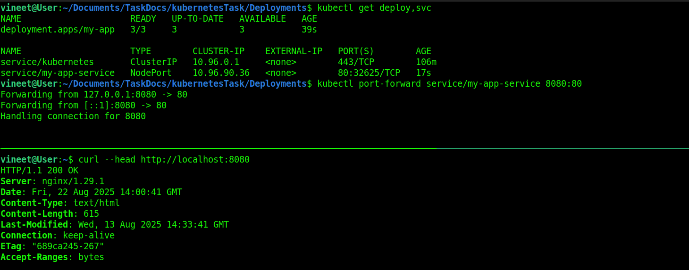
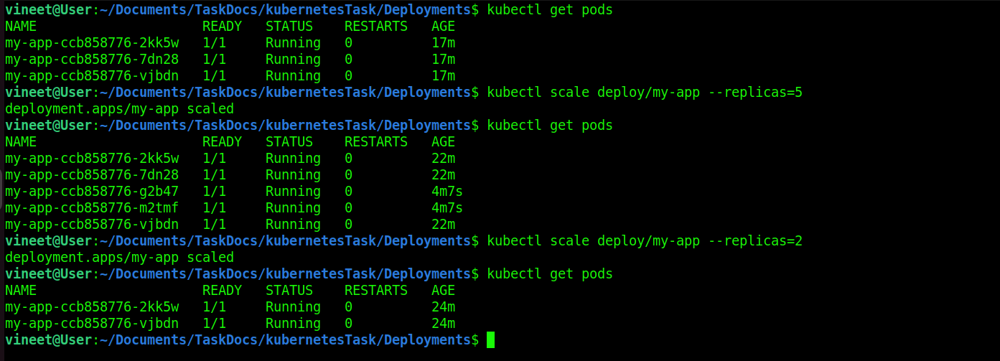
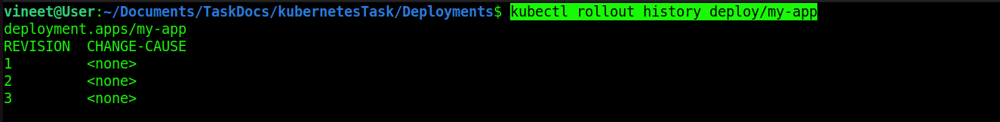
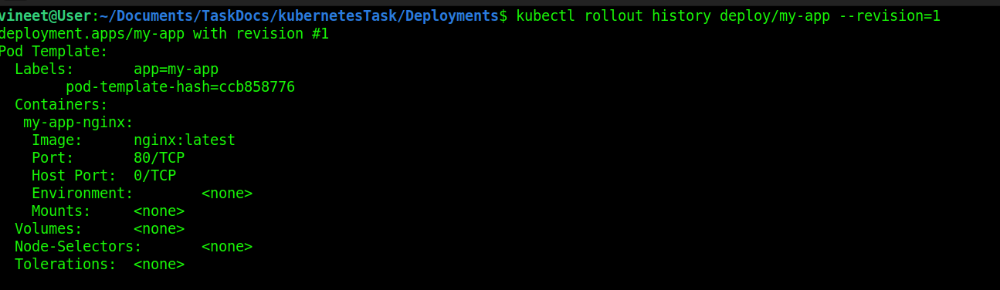
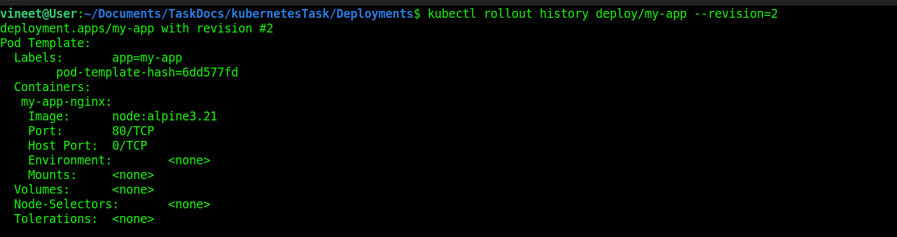
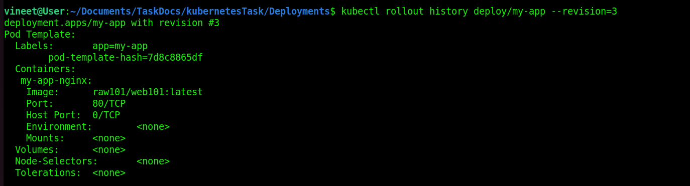
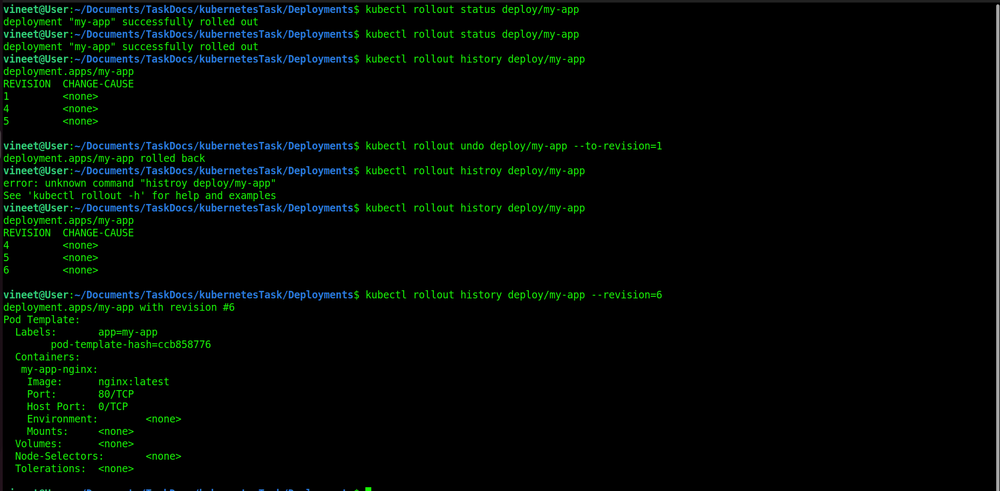

# Learn ReplicaSet vs Deployment.

# What is ReplicaSet ?
### A ReplicaSet in Kubernetes ensures that a specific number of identical Pods are always running.

## It maintains Pod replicas:
* 1. If a Pod crashes → ReplicaSet creates a new one.  
* 2. If extra Pods exist → ReplicaSet deletes the extra ones.  
* 3. It uses labels & selectors to identify which Pods it should manage.  
* 4. Usually, you don’t create ReplicaSets directly → they are managed by Deployments.  

<hr>

# What is Deployment ?
### A Deployment is one of the most common Kubernetes objects. It sits on top of ReplicaSets and makes managing your Pods much easier.

## Key Features of a Deployment: 

### Declarative Updates

* You describe in YAML how many replicas you want, what image to use, etc.

* Kubernetes ensures the cluster matches that desired state.

### ReplicaSet Management

* Deployment automatically creates and manages ReplicaSets → which then manage Pods.

### Rolling Updates

* When you update the Deployment (e.g., new Docker image version), it replaces Pods gradually (without downtime).

### Rollbacks

* If something breaks in a new version, you can easily rollback to the previous working ReplicaSet.


## Difference between ReplicaSet and Deployment

* **ReplicaSet** = ensures a fixed number of Pods are running.

* **Deployment** = manages ReplicaSets (and adds features like rolling updates, rollbacks).

<hr>

# Tasks:

### Create a Deployment with 3 replicas of nginx.

* To Check Deployment apiVersion We can use ``` kubectl api-resources | grep Deployment ``` . 
* I Create Deployment.yaml and service.yaml file to create deployment ro service. 
* Deployment.yaml file [ Deployment.yaml ](../Deployments/Deployment.yaml).  
* Service yaml file [ service.yaml ](../Deployments/service.yaml) .
* Now run both file to check working or not .
* use this command to run 
``` 
kubectl apply -f Deployment.yaml
kubectl apply -f service.yaml
```
* To Check Deployment working or not. 
``` 
kubectl get deploy,svc
kubectl port-forward service/my-app-service 8080:80 
```



> ``` kubectl scale <resource_type>/<resource_name> --replicas=<number> ``` 


* **Scale Up Replicas** 

``` 
kubectl scale deploy/my-app --replicas=5 
``` 

* **Scale Down Replicas** 

``` 
kubectl scale deploy/my-app --replicas=2 
``` 



# Update the image → perform a rolling update.

## I added two new images in Deployment.yaml first time i add node and raw101/web101 to check 


* Get Revision Version 
```
kubectl rollout history deploy/my-app
```



```
kubectl rollout history deploy/my-app --revision=1
```



```
kubectl rollout history deploy/my-app --revision=2
```



```
kubectl rollout history deploy/my-app --revision=3
```


* Update Deployment 
* Check revision version and it's images
* check ``` kubectl rollout history deploy/deploymentName ```
* check ``` kubectl rollout undo deploy/deploymentName ```
* Rollback to a specific revision ``` kubectl rollout undo deploy/deploymentName --to-revision=Number ```




## And delete Deployment And it's Service.

```
kubectl delete -f Deployment.yaml
kubectl delete -f service.yaml
```