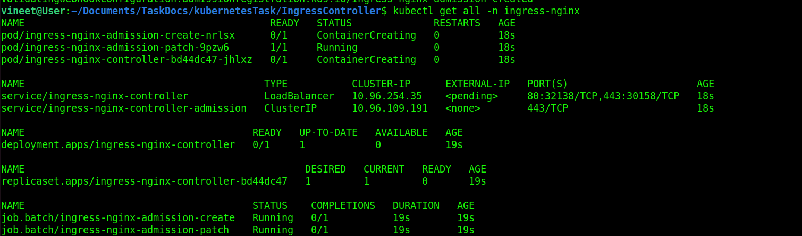
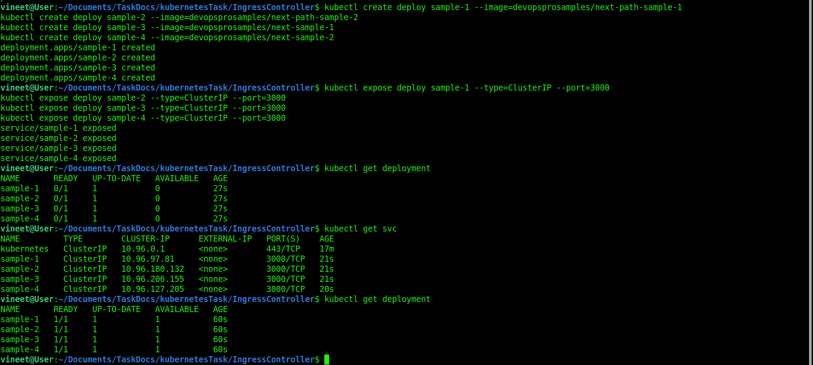
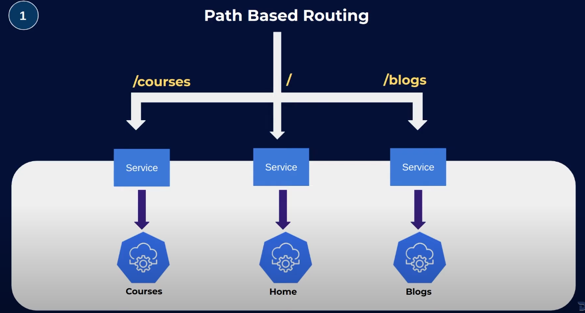
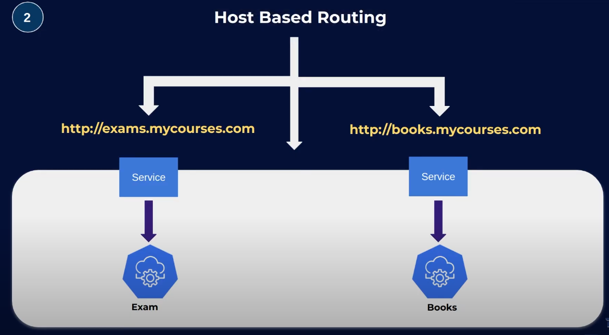
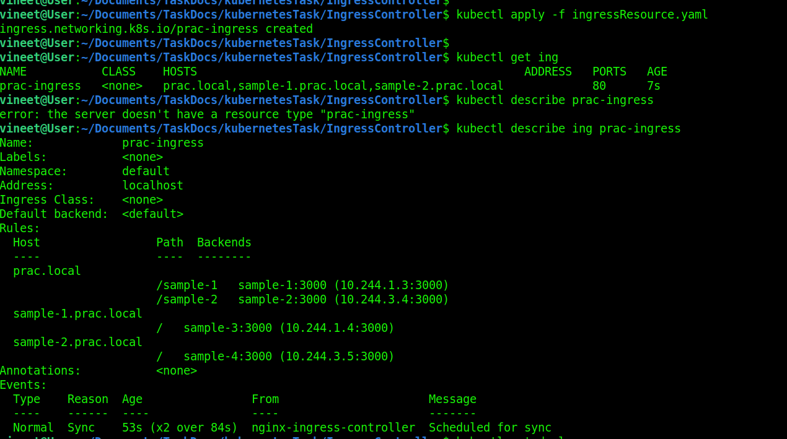
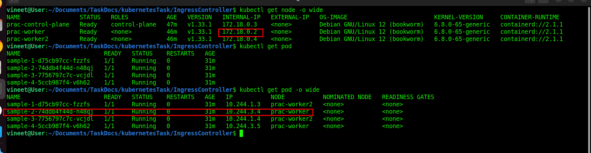
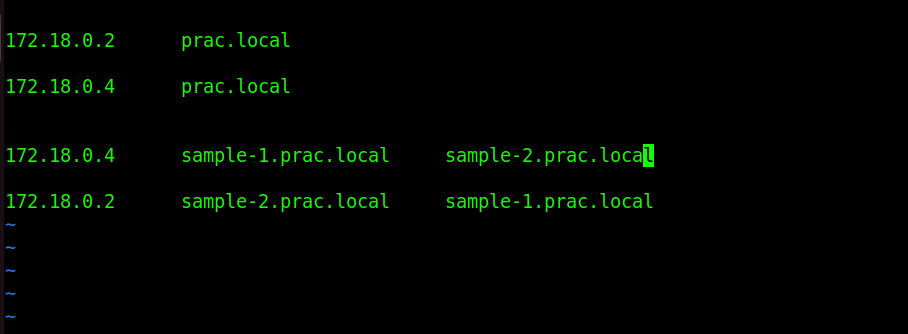

The NGINX Ingress Controller is a Kubernetes component that manages external access to services running inside a Kubernetes cluster, typically via HTTP and HTTPS. 

# What is Ingress? 
* In Kubernetes, an Ingress is an API object that defines rules for routing external HTTP/HTTPS traffic to internal services.
* Example use case:
    * You have multiple services (like service-A, service-B, service-C).
    * Instead of exposing each with a LoadBalancer or NodePort, you create an Ingress resource that routes requests based on the hostname or path.


# What is an Ingress Controller?
* The Ingress Controller is the actual software that reads the Ingress rules and configures a reverse proxy/load balancer accordingly.
* Kubernetes only defines the Ingress API — it does not provide a default controller. You must install one, like:

    * NGINX Ingress Controller (most common)
    * HAProxy Ingress
    * Traefik
    * AWS/GCP/Azure cloud-specific ingress controllers


# NGINX Ingress Controller 
* The NGINX Ingress Controller uses NGINX (or NGINX Plus) as a reverse proxy and load balancer.  
* It watches the Kubernetes API for Ingress resources and automatically configures NGINX to route traffic.
* Features:
    * Path-based routing (/app1 → service1, /app2 → service2)
    * Host-based routing (app1.example.com → service1)
    * SSL/TLS termination (HTTPS support)
    * URL rewrites and redirects
    * Load balancing between service pods
    * Authentication, rate limiting, and security controls

<hr>

* I Create Cluster with kind and port mapping 80 and 443.  
* I used ingressCluster.yaml file to create port [ingressCluster.yaml](./ingressCluster.yaml)
* I used this docs to create cluster with kind and port mapping [Link](https://kind.sigs.k8s.io/docs/user/ingress).
* i follow this repo to perform my task . [Link](https://github.com/devopsproin/certified-kubernetes-administrator/tree/main/Ingress).

### Issue i face when i create service/ingress-nginx-controller showing type is loadbalancer so i change it.



```
kubectl get all -n ingress-nginx
kubectl get svc -n ingress-nginx
kubectl edit svc ingress-nginx-controller -n ingress-nginx
```

### i change service type loadbalancer to nodePort. 


## Create Deployments
Next, you will need to create some sample Deployments to route traffic to. Run the following commands to create the Deployments:

```
kubectl create deploy sample-1 --image=devopsprosamples/next-path-sample-1
kubectl create deploy sample-2 --image=devopsprosamples/next-path-sample-2
kubectl create deploy sample-3 --image=devopsprosamples/next-sample-1
kubectl create deploy sample-4 --image=devopsprosamples/next-sample-2
```
## Create services
After you have created the Deployments, you will need to create Services for each of them. Run the following commands to create the Services:
```
kubectl expose deploy sample-1 --type=ClusterIP --port=3000
kubectl expose deploy sample-2 --type=ClusterIP --port=3000
kubectl expose deploy sample-3 --type=ClusterIP --port=3000
kubectl expose deploy sample-4 --type=ClusterIP --port=3000
```



#### I create ingressResource.yaml to host base routing and path base routing. [ingressResource.yaml](./ingressResource.yaml).

## Path Base Routing Look like that.
.

## Host Base Routing Look like that.


#### run to ingressResource.yaml file to routing.
#### create ingress reouces.

```
kubectl apply -f ingressResource.yaml
kubectl get ing
kubectl describe ing prac-ingress
```




### Issue 
* if your using kubernetes and running multi node cluster on your local system and performing a task path base or host base routing.
* So used ```single node cluster``` if not and your using multinode than use ```lables``` and  ```nodesSelector``` to pod deploy on a single node.
* The issue is if your are using multinode and doing host base and path base routing. pods are deploying anthor nodes. you need collect multiple ip to access pods to perform path  base and host base routing . 
* ``` sample-1-d75cb97cc-fzzfs ``` pod is ```prac-worker2 ``` 
* ``` sample-2-74ddb4f44d-n48qj``` pod is ``` prac-worker ``` 
* In those pods i using path base routing. 

.

* simple way to do like this.  
```
sudo vim /etc/hosts
````

.

<hr>

### Test Done


