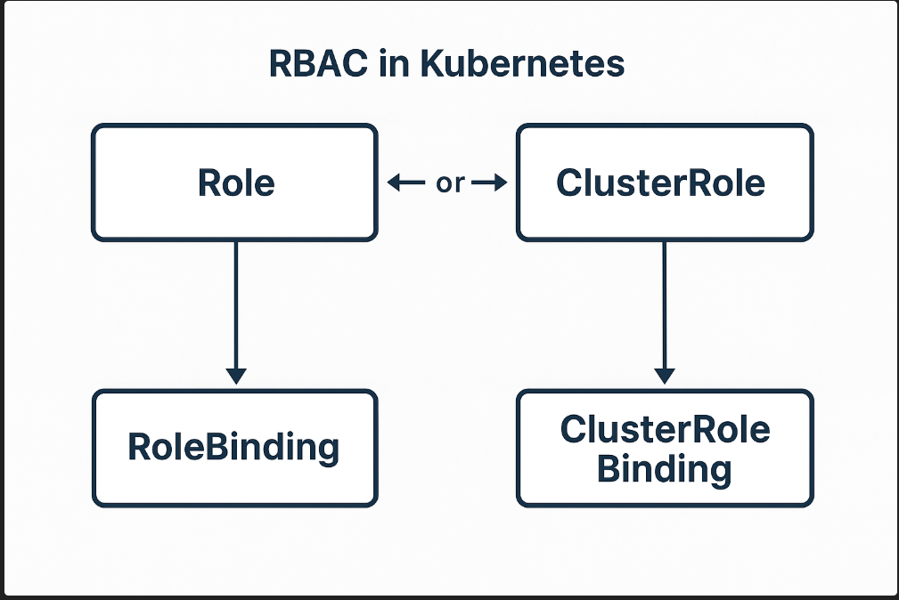
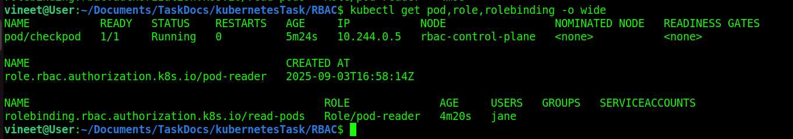
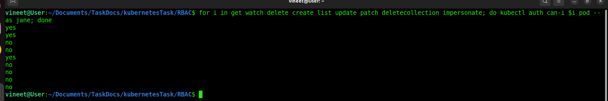
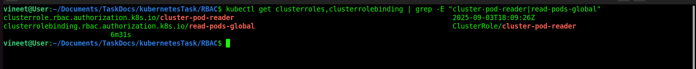
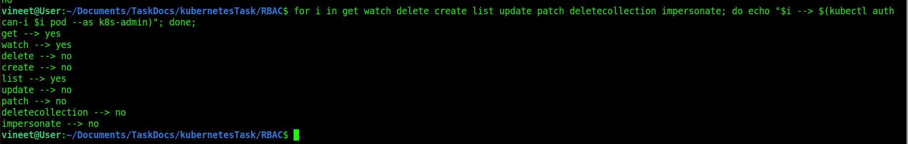
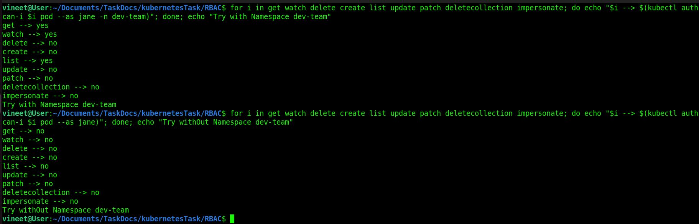
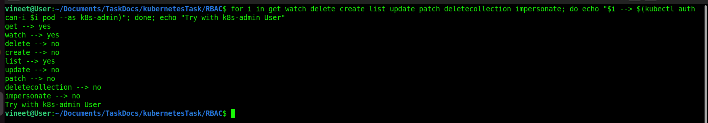

**In Kubernetes, Authorization Modes define how the API server decides whether a request is allowed or denied after authentication.**
* **When a request comes to the API server:**
    * **Authentication** checks who is making the request.
    * **Authorization** checks what they are allowed to do.
    * **Admission Control** applies extra checks and defaults.


## Common Authorization Modes in Kubernetes:
* **Node**
    * Authorizes kubelets (nodes) to read/write resources they need, like Pods, Secrets, and ConfigMaps on the same node.
* **ABAC (Attribute-Based Access Control)**
    * Uses policies defined in a JSON file with rules based on user, group, or other request attributes.
    * Flexible but hard to manage at scale → mostly replaced by RBAC.
* **RBAC (Role-Based Access Control)**
    * Uses Roles, ClusterRoles, and (Cluster)RoleBindings to assign permissions.
    * Most common and recommended authorization mode.
* **Webhook**
    * Delegates authorization decisions to an external service (via HTTP call).
    * Useful for custom policies (e.g., integrating with corporate IAM).


# RBAC in Kubernetes stands for Role-Based Access Control.
**It’s a way to control who (users, groups, or service accounts) can do what (verbs like get, list, create, delete) on which resources (pods, deployments, secrets, etc.) inside a Kubernetes cluster.**

### **Key Concepts in RBAC:**
* **Role**
    * Defines a set of permissions within a namespace.
    * Example: A Role might allow someone to "read pods" in the dev namespace.
* **ClusterRole**
    * Similar to Role, but applies cluster-wide or across multiple namespaces.
    * Example: A ClusterRole might allow access to nodes, which aren’t namespaced.
* **RoleBinding**
    * Grants the permissions defined in a Role to a user/group/service account in a specific namespace.
* **ClusterRoleBinding**
    * Grants a ClusterRole to a subject across the entire cluster.


* **Common Verbs in a Role**
    * **get** → Read a single resource (e.g., kubectl get pod mypod).
    * **list** → List multiple resources (e.g., kubectl get pods).
    * **watch** → Watch resources for changes (used by controllers).
    * **create** → Create new resources.
    * **update** → Update existing resources.
    * **patch** → Partially update resources.
    * **delete** → Delete resources.
    **deletecollection** → Delete multiple resources at once.
    * **impersonate** → Act as another user/service account.


<hr>

# Now Check Role and RoleBinding 
* I create **[role.yaml](./role.yaml)** file for Role and **[rolebinding.yaml](./rolebinding.yaml)** file to RoleBinding and deploy it. 
* let's create pod **[checkpod.yaml](./checkpod.yaml)**.

```
kubectl apply -f role.yaml
kubectl apply -f rolebinding.yaml
kubectl apply -f checkpod.yaml
kubectl get pod,role,rolebinding -o wide
```


#### Check All Verbs for Jane user.
```
for i in get watch delete create list update patch deletecollection impersonate; do kubectl auth can-i $i pod --as jane; done
```



**Delete Role And RoleBinding**
```
for i in role.yaml rolebinding.yaml; do kubectl delete -f $i; done;
```

<hr>

# Now Check ClusterRole and ClusterRoleBinding.
* I create **[ClusterRole.yaml](./ClusterRole.yaml)** file for ClusterRole and **[ClusterRoleBinding.yaml](./ClusterRoleBinding.yaml)** file for ClusterRoleBinding.
* Use this file **[checkpod](./checkpod.yaml)** to create pod. 
* now apply all files.
* my pod is already created.

```
kubectl apply -f ClusterRole.yaml
kubectl apply -f ClusterRoleBinding.yaml

            OR
for i in ClusterRole.yaml ClusterRoleBinding.yaml; do kubectl apply -f $i; done
kubectl get clusterroles,clusterrolebinding | grep -E "cluster-pod-reader|read-pods-global"
```


#### Now Check Verbs 
```
for i in get watch delete create list update patch deletecollection impersonate; do echo "$i --> $(kubectl auth can-i $i pod --as k8s-admin)"; done;
```



#### Delete ClusterRole and ClusterRoleBinding
```
for i in ClusterRole.yaml ClusterRoleBinding.yaml; do kubectl delete -f $i; done;
```

<hr>

## Now Check With Namespace Role And RoleBinding
* i create namespace name is dev-team
* apply role and role binding to check 
* change namespace ```default``` to ```dev-team``` and create role and rolebinding.

```
kubectl create namespace dev-team

for i in checkpod.yaml role.yaml rolebinding.yaml; do kubectl apply -f $i; done;

for i in get watch delete create list update patch deletecollection impersonate; do echo "$i --> $(kubectl auth can-i $i pod --as jane -n dev-team)"; done; echo "Try with Namespace dev-team"

for i in get watch delete create list update patch deletecollection impersonate; do echo "$i --> $(kubectl auth can-i $i pod --as jane)"; done; echo "Try withOut Namespace dev-team"
```


**Now Delete Role and RoleBinding**
```
for i in role.yaml rolebinding.yaml; do kubectl delete -f $i; done;
```

## Now Check With Namespace ClusterRole And ClusterRoleBinding
* create clusterrole and clusterRoleBinding and check.
* my pod created on dev-team namespace.
```
for i in ClusterRole.yaml ClusterRoleBinding.yaml; do kubectl apply -f $i; done;

for i in get watch delete create list update patch deletecollection impersonate; do echo "$i --> $(kubectl auth can-i $i pod --as k8s-admin)"; done; echo "Try with k8s-admin User"
```


## Delete All of this.
```
for i in checkpod.yaml ClusterRole.yaml ClusterRoleBinding.yaml; do kubectl delete -f $i; done;
```