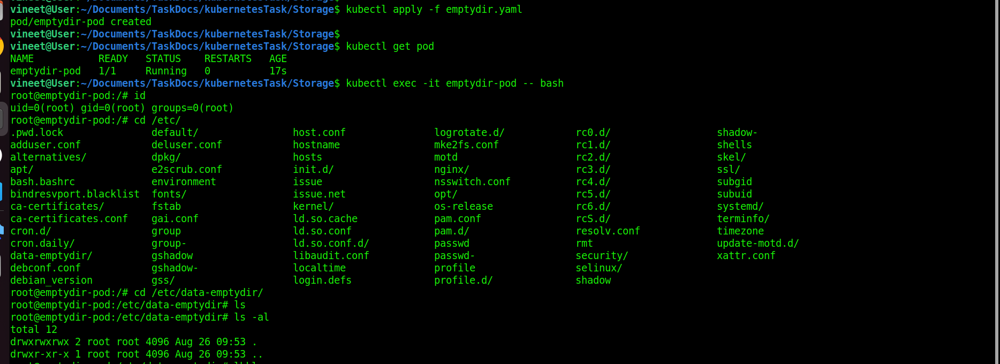
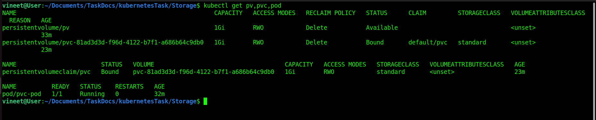
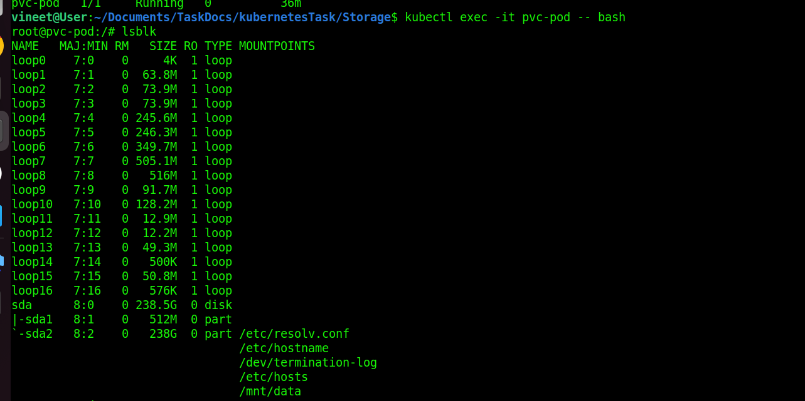
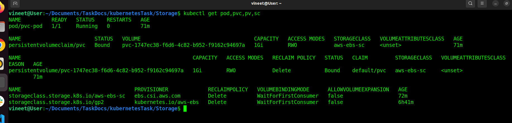
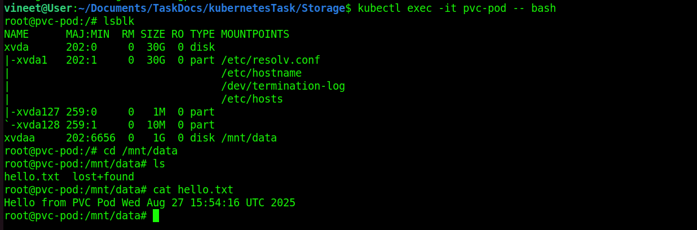

# What is Storage in Kubernetes?
Kubernetes (K8s) is mainly for running containerized apps. Containers are ephemeral (temporary) — if a Pod dies, its data inside the container is lost. So, we need storage solutions to persist data across Pod restarts, scaling, and migrations.

## Types of Storage in Kubernetes

* ### EmptyDir
    * A simple temporary directory created when a Pod starts.
    * Lives as long as the Pod is running.
    * Data is deleted once the Pod is deleted.
    * Use case: caching, temporary scratch space.
* I create a pod and passed emptydir [emptydir.yaml](./emptydir.yaml).  
* I check dir i created inside the container .

```
kubectl apply -f emptydir.yaml 
kubectl get pod
kubectl exec -it emptydir-pod -- bash
```



* ### HostPath
    * Mounts a file or directory from the Node’s filesystem into the Pod.
    * Data persists only on that specific node.
    * Use case: when Pod must access node-specific files (e.g., logs).
    * Not good for production because Pods may move to another node.

* ### PersistentVolume (PV) & PersistentVolumeClaim (PVC)
    * This is the standard way to manage storage in Kubernetes.
    * PV → The actual storage resource (like EBS, NFS, GCE Disk, etc.).
    * PVC → A request for storage by a Pod (like asking for "10Gi of storage").
    * Pods use PVC, not PV directly.
    * Kubernetes matches PVCs to available PVs.      

#### i create a pv.yaml and pvc.yaml file to create pv and pvc.
#### i usePVCPod.yaml file to create pod. 
```
kubectl apply -f pv.yaml
kubectl apply -f pvc.yaml
kubectl apply -f usePVCPod.yaml
kubectl get pv,pvc,pod
```



#### i check my volume mount 



* ### StorageClass
    * Automates dynamic provisioning of PersistentVolumes.
    * Instead of manually creating PVs, Kubernetes dynamically provisions storage from cloud    providers (like AWS EBS, GCP Persistent Disk, Azure Disk).
    * Each StorageClass defines provisioner (type of storage) and parameters.  
* I Used AWS EBS storage.          
* create secret and store accessKey and secretKey in secret . [secretforaws.yaml](./secretforaws.yaml)      

<hr>

* install aws-ebs-csi-driver on cluster. 
* i used docs to install aws-ebs-csi-driver [docslink](https://github.com/kubernetes-sigs/aws-ebs-csi-driver/blob/master/docs/install.md).


### Issue I face 
* when i create pod. it's status showing me pending. 

## ✅ Fix: Give IAM permissions to the EBS CSI driver
In EKS, you must use IAM Roles for Service Accounts (IRSA) for CSI drivers.
* ### 1️⃣ Check if IRSA is enabled on your cluster
```
eksctl utils associate-iam-oidc-provider --cluster demoCluster --region us-east-1 --approve
```
* ### 2️⃣ Create IAM policy for EBS CSI driver
Download the AWS-managed policy:
```
curl -o ebs-csi-policy.json https://raw.githubusercontent.com/kubernetes-sigs/aws-ebs-csi-driver/master/docs/example-iam-policy.json
```
Create the policy in IAM:
```
aws iam create-policy \
  --policy-name AmazonEKS_EBS_CSI_Driver_Policy \
  --policy-document file://ebs-csi-policy.json
```
* ### 3️⃣ Create IAM service account for the CSI driver
```
eksctl create iamserviceaccount \
  --cluster demoCluster \
  --namespace kube-system \
  --name ebs-csi-controller-sa \
  --attach-policy-arn arn:aws:iam::<YOUR_AWS_ACCOUNT_ID>:policy/AmazonEKS_EBS_CSI_Driver_Policy \
  --approve \
  --region us-east-1
```
* ### 4️⃣ Re-deploy / Restart the EBS CSI driver
If you installed it as an EKS add-on, just update:
```
eksctl create addon --name aws-ebs-csi-driver --cluster demoCluster --region us-east-1 --force
```

If you installed via Helm, patch the deployment to use the new service account:

```
kubectl -n kube-system set serviceaccount deployment ebs-csi-controller ebs-csi-controller-sa
kubectl -n kube-system rollout restart deployment ebs-csi-controller
```

* ### 5️⃣ Re-try PVC
Now delete and recreate the PVC/Pod:
```
kubectl delete pod pvc-pod
kubectl delete pvc pvc
kubectl apply -f pvc.yaml
kubectl apply -f usePVCPod.yaml
```

## after i test 


### Check mount file
```
kubectl exec -it pvc-pod -- bash
```



* ### Volume Types (Plugins)
    * #### Kubernetes supports many volume plugins:
        * NFS (Network File System)
        * AWS EBS (Elastic Block Store)
        * GCE PersistentDisk
        * Azure Disk / Azure File
        * CephFS, GlusterFS
        * CSI (Container Storage Interface) → modern, standard way to connect any storage provider.
    

* ### Access Modes
    * **ReadWriteOnce (RWO)** → Mounted read-write by a single node.
    * **ReadOnlyMany (ROX)** → Mounted read-only by many nodes.
    * **ReadWriteMany (RWX)** → Mounted read-write by many nodes (shared storage, like NFS).