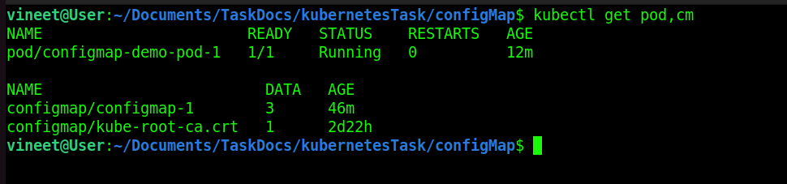
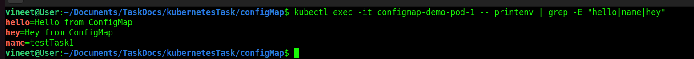
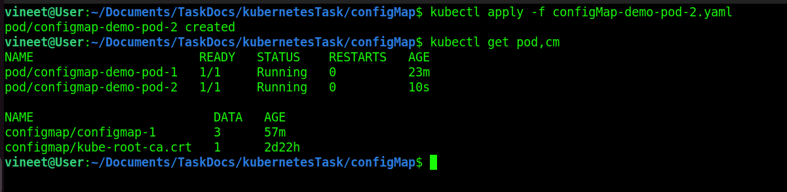
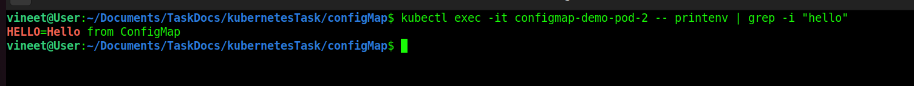
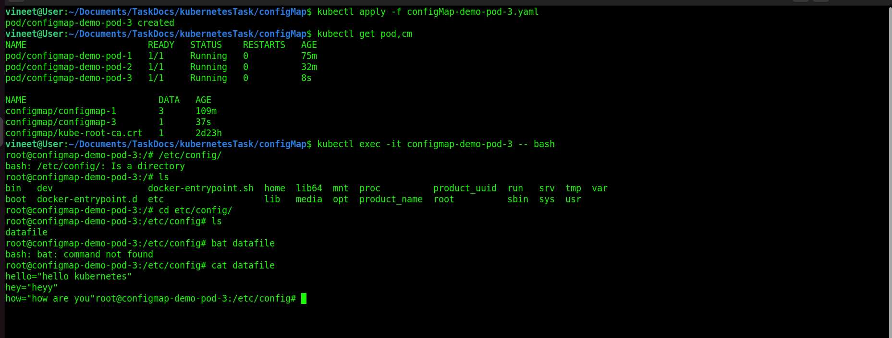

# configMap 
A ConfigMap is an API object used to store non-confidential data in key-value pairs. Pods can consume ConfigMaps as environment variables, command-line arguments, or as configuration files in a volume.

## pass ConfigMap in Pod 
* create a confiMap-1.yaml file [configMap.yaml](../configMap/configMap-1.yaml) to create configmap
* create configMap-demo-pod-1.yaml file pass configmap inside the pod [configMap-demo-pod-1.yaml](../configMap/configMap-demo-pod-1.yaml)
* now create pod and configmap 
```
kubectl apply -f configMap-1.yaml
kubectl apply -f configMap-demo-pod-1.yaml
```
* Check Pod and ConfigMap are running or not 
```
kubectl get pod,cm
```
* both are running.



* Check our enviroment variables
```
kubectl exec -it configmap-demo-pod-1 -- printenv | grep -E "hello|name|hey"
```
* Output 



* ### issue 
``` 
if i change in configMap runnig pod not see the changes .
i need to restart the pod.

```


## Pass a Value from ConfigMap in Pod 
* i used previous configMap-1.yaml file [configMap.yaml](../configMap/configMap-1.yaml) and pass a value to the configmap-demo-pod-2 
* create new pod to pass a single env .
```
kubectl apply -f configMap-demo-pod-2.yaml
kubectl get pod,cm
```


* now check our env. 
```
kubectl exec -it configmap-demo-pod-2 -- printenv | grep -i "hello"
```


## Pass file 
* use this command to create yaml file to pass datafile
```
kubectl create configmap configmap-3 --from-file=datafile --dry-run=client -o yaml > configMap-3.yaml
```

* create pod and configmap
```
kubectl apply -f configMap-3.yaml
kubectl apply -f configMap-demo-pod-3.yaml
kubectl get pod,cm 
```
* check file there exits or not 





* Delete all pods 

```
kubectl delete pod $(kubectl get pod | awk 'NR != 1 { print $1 }')
```