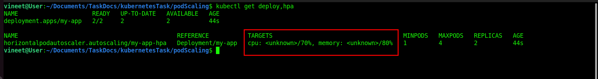
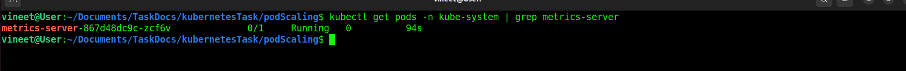
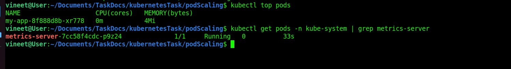

# Pod Scaling
Pod scaling means adjusting the number of Pod replicas in a Deployment, ReplicaSet, or StatefulSet to handle workload demand.
* **Scale up** → Add more Pods to handle higher load.
* **Scale down** → Remove Pods to save resources when load decreases.

**Types of Pod Scaling in Kubernetes**
* **Manual Scaling**
    * You explicitly set the number of replicas.
        * **Pros**: Simple, predictable.
        * **Cons**: Not responsive to traffic changes (static)
* **Horizontal Pod Autoscaling (HPA)**
    * Kubernetes automatically adjusts the number of Pods based on CPU, memory, or custom metrics.
        * **Pros**: Responds dynamically to workload demand.
        * **Cons**: Only scales the number of Pods, not resources inside Pods.
* **Vertical Pod Autoscaling (VPA)**
* Adjusts CPU and memory requests/limits of existing Pods (not the replica count).
    * **Example:** If a Pod needs more CPU, VPA increases its limits.
    * **Pros**: Helps right-size Pods.
    * **Cons**: Pods may restart when resources are changed.
* **Cluster Autoscaler (CA)**
    * Not Pod scaling directly, but works with HPA/VPA.
    * Scales the nodes in the cluster when Pods cannot be scheduled due to insufficient resources.


# Check Horizontal Pod Autoscaling (HPA)
* i create a file for deployment [deployment.yaml](./deployment.yaml).
* create a file for HPA [HPA.yaml](./HPA.yaml).
* run both files.

```
for i in deployment.yaml HPA.yaml; do kubectl apply -f $i; done;
```

## Issue



**This means the HPA controller cannot fetch CPU metrics. Common reasons:**
**🔎 Why it happens**
* **Metrics Server not installed**
    * HPA relies on the metrics-server to read CPU/Memory usage.
    * If it’s missing, you’ll always see <unknown>.
* **Metrics Server not working**
    * Not deployed in kube-system namespace properly.
    * TLS/flags misconfigured (--kubelet-insecure-tls often needed in Kind/Minikube).
* **No load on the app**
    * If your my-app Pods aren’t using CPU yet, metrics may be missing initially.


**✅ Fix**
* **Check if metrics server is running:**
    * You should see a pod like metrics-server-xxxxxx in Running state.
```
kubectl get pods -n kube-system | grep metrics-server
```
* **If not installed, deploy it:**
```
kubectl apply -f https://github.com/kubernetes-sigs/metrics-server/releases/latest/download/components.yaml

kubectl get pods -n kube-system | grep metrics-server
```


**Your metrics-server pod is stuck in 0/1 Running, which means the container is created but not healthy → so it can’t serve metrics to HPA.**
**🔎 Common causes**
* **TLS issue**s (very common on Kind, Minikube, or custom clusters).
    * The metrics-server tries to talk to kubelets securely, but kubelets often use self-signed certs.
* **Missing startup flags** in metrics-server deployment.

**✅ Fix**
**Edit the metrics-server deployment and add these flags:**
```
kubectl edit deployment metrics-server -n kube-system
```
**Find the container ```args:``` section and make sure it includes:**
```
 args:
    - --kubelet-insecure-tls
```
```
kubectl rollout restart deployment metrics-server -n kube-system
```
* **Test metrics collection:**
```
kubectl top pods
```
